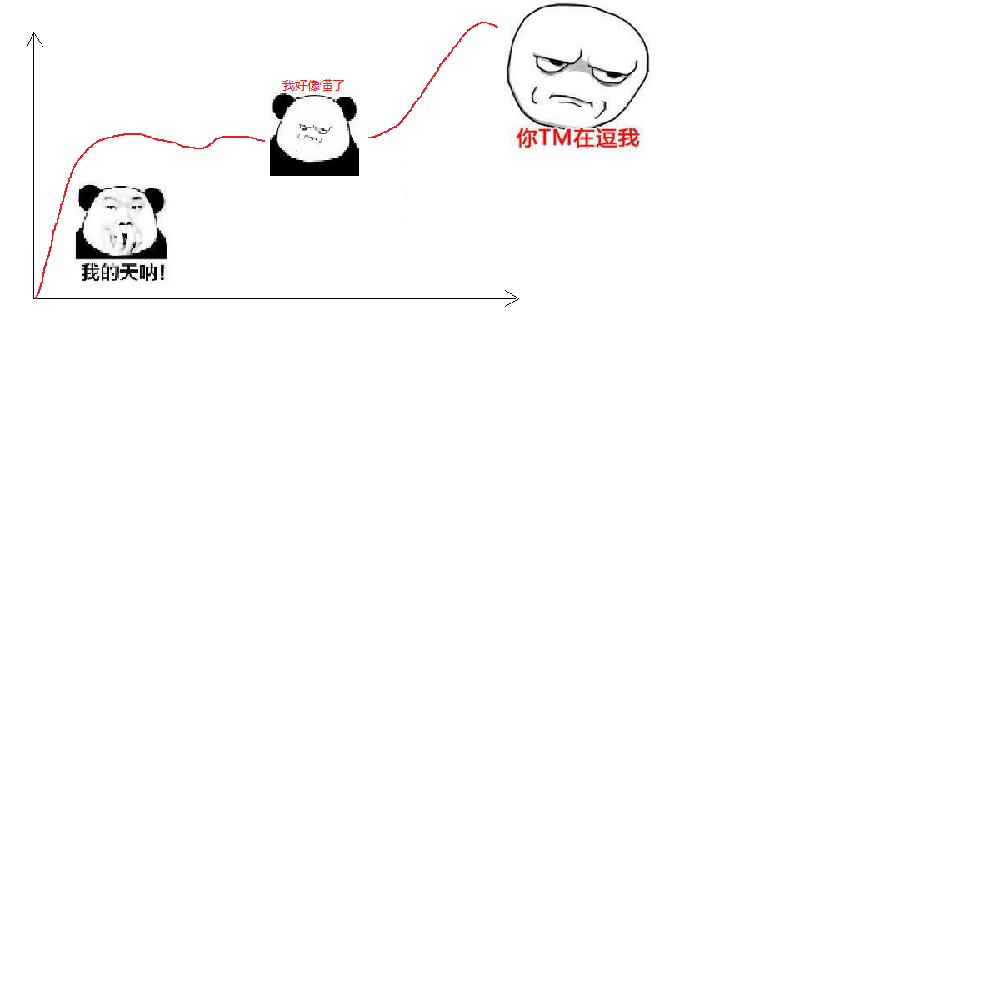

## Angular 是什么

Angular（读音['æŋgjʊlə]）是一套用于构建用户界面的 JavaScript 框架。由 Google 开发和维护，主要被用来开发单页面应用程序。

## 核心特性

- MVVM
- 组件化
- 模块化
- TypeScript
- ...

## 发展历史

### 起源

2009年，Misko hevery 和 Adam abrons 在业余时间打造了 `GetAngular`

Misko Hevery 接手了 Google 内部的一个项目 `Feedback` ，该项目经过6个月的迭代代码量已经达到了17000行。项目的开发和维护已经变得非常的困难。所有 Misko 就决定用 `GetAngular` 重写这个项目。

结果就是小伙子成功了，使用 ``GetAngular` 之后该项目从17000行缩减到了1500行，前后仅仅使用了三周时间。

Misko 领导一看，小伙子厉害啊，同时也看到了 `GetAngular` 所带来的商业价值，所以决定把  `GetAngular` 正式立项，组织专职团队开发和维护。

由于已不再是 Misko 个人项目，所以开发团队将 `GetAngular` 重新命名为了 `AngularJS` 。

至此，AngularJS 就进入了漫长的发展迭代阶段。

- 经过了3年的发展，AngularJS 在2012年6月份，`1.0.0` 版本正式推出。
- AngularJS 在1.2之后的版本不再支持 IE 6和7
- AngularJS 在 1.3 之后不再支持 IE8
- AngularJS 在 1.5 增加了类似组件化的开发方式
  - 为过渡到 Angular2 做铺垫
- AngularJS `1.x.x` 当前已发布到了 `1.6.x`

### 困境

- 饱受诟病的性能问题
  - 脏检查
- 落后于当前 Web 发展理念
  - 例如组件化
  - 模块化支持不好
- 对移动端支持不够友好

### Angular 2 横空出世

Angular 1.x 由于问题太多，历史包袱太重，重构几乎不可能。

不过早在2014年3月，官方博客就有提及开发新版本 Angular 的计划。

2014年9月下旬一个大会上，Angular2 正式亮相。

2016年9月15号，Angular2正式发布。

由于 ng2 几乎完全重写了 ng1 ，所以官方把2之后的版本都称之为 Angular。

Angular 2 之后的正式 Logo：

新版本发布了，那用户如何从 1 升级到 2 呢？

- ng 2 完全不兼容 ng 1
- ng1 AngularJS
- ng2 Angular
- 目前 ng 2 已经发展到了 5
- 但是 5 是向下兼容的

- 2016年9月15日，Angular 2 正式版发布。
- ​

## 应用场景

## 特点

> https://angular.io/features

- 跨平台
- 速度和性能
- 生产力
- 完整的开发支持

## 学习 Angular 的一些建议

## 一些资源

> https://angular.io/docs

- [快速开始](https://angular.io/guide/quickstart)
- [Tutorial: Tour of Heroes](https://angular.io/tutorial)
- [核心概念](https://angular.io/guide/architecture)
- [技巧](https://angular.io/guide/i18n)
- [API](https://angular.io/api)

